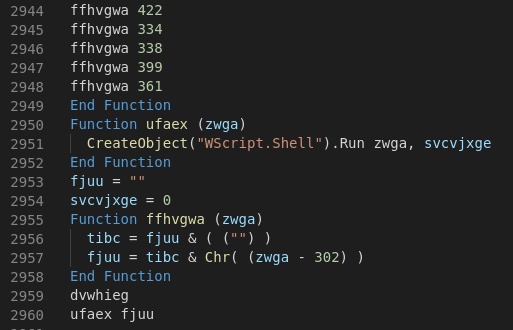
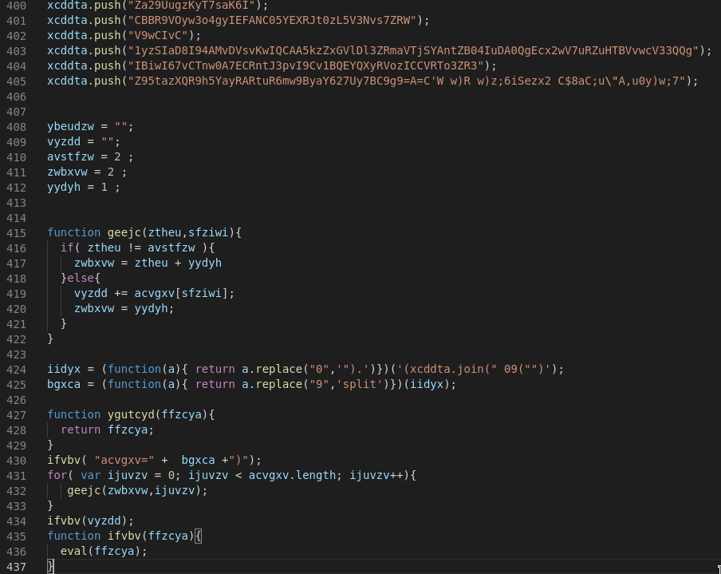

# GootJasperDeobfuscator
A deobfuscation script for Gootkit / Jasper Loader Malware

## Usage 

``` python3 gootdecrypt.py script.vbs ``` or ``` python3 gootdecrypt.py script.js```

The first VBS script is dropped via a ZIP File ([VBS AnyRun Analysis](https://app.any.run/tasks/ebd5b4d1-15f6-4d3d-a976-2db3335302a1/)). It executes an obfuscated and base64 encoded PowerShell script.





The second stage is a classic Jasper Loader Sample (Javascript file that contains another PowerShell script, [Jasper AnyRun Analysis](https://app.any.run/tasks/1028612c-a3fa-4c7d-babf-189bba0c1aaa))




*gootdecrypt.py* will return the decoded PowerShell script as well as the inline PS Base64 string.
